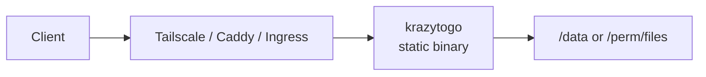

# Krazy To-Go Box

**One tiny static Go binary that serves files — the same build on gokrazy, Docker/Podman, and Kubernetes.**

[](https://github.com/crimsonflower420/KrazyTakeoutGoBox/actions/workflows/ci.yml)
[](https://go.dev/)
[](https://ghcr.io/crimsonflower420/krazytogo)
[](LICENSE)
[](https://buymeacoffee.com/grantgollak)

Hyper-minimal by design: pure `net/http`, no CGO, no frameworks, and **no** in-process auth, uploads, WebDAV, or admin UI. Put Tailscale, Caddy, or an Ingress in front when you need access control or TLS.

| | |
|---|---|
| **Module** | `github.com/crimsonflower420/KrazyTakeoutGoBox` |
| **Package** | `cmd/krazytogo` |
| **Image** | [`ghcr.io/crimsonflower420/krazytogo:latest`](https://ghcr.io/crimsonflower420/krazytogo) |
| **Website** | [krazytogobox.pages.dev](https://krazytogobox.pages.dev) |
| **Footprint** | ~5.4 MiB stripped static binary (`CGO_ENABLED=0`, `-ldflags=-s -w`, linux/amd64); stdlib only |
| **License** | GPL-3.0 (see [`LICENSE`](LICENSE)) |
| **Support** | [Buy Me a Coffee](https://buymeacoffee.com/grantgollak) · GitHub Sponsor button |

## Why

Most “simple” file servers grow a web UI, upload forms, and half an identity stack. The Krazy To-Go Box stays boring on purpose:

- **Same binary everywhere** — gokrazy appliance, `FROM scratch` container, or hardened Kubernetes
- **Tiny attack surface** — read-only serving, path escape rejected, directory browse is a flag
- **Ops-friendly** — `/healthz`, Range requests, flags + env with clear precedence
- **Access stays outside** — Tailscale / reverse proxy / Ingress, not baked into the process

## Quick start

Install the binary:

```bash
go install github.com/crimsonflower420/KrazyTakeoutGoBox/cmd/krazytogo@latest
mkdir -p data && echo hello > data/hello.txt
krazytogo -root ./data -addr :8080
# → http://127.0.0.1:8080/hello.txt
# → http://127.0.0.1:8080/healthz  → 200 ok
```

From a checkout (no install):

```bash
mkdir -p data && echo hello > data/hello.txt
go run ./cmd/krazytogo -root ./data -addr :8080
```

Static build:

```bash
CGO_ENABLED=0 go build -trimpath -ldflags="-s -w" -o krazytogo ./cmd/krazytogo
./krazytogo -root ./data -addr :8080
```

## Configuration

Precedence: **flags > env > defaults**.

| Flag | Env | Local / container default | gokrazy (`-tags gokrazy`) |
|------|-----|---------------------------|---------------------------|
| `-root` | `KRAZY_ROOT` | `./data` (use `/data` in images) | `/perm/files` |
| `-addr` | `KRAZY_ADDR` | `:8080` | `:80` |
| `-browse` | `KRAZY_BROWSE` | `true` | `true` |

`KRAZY_BROWSE` accepts Go `ParseBool` values (`1`, `t`, `true`, `0`, `f`, `false`, …). When browse is off, directories return 404; files still serve.

## Deploy

### Docker / Podman

Published image (GHCR): `ghcr.io/crimsonflower420/krazytogo:latest`

```bash
mkdir -p data && echo hello > data/hello.txt

docker pull ghcr.io/crimsonflower420/krazytogo:latest
docker run -d -p 8080:8080 -v "$PWD/data:/data" ghcr.io/crimsonflower420/krazytogo:latest

podman pull ghcr.io/crimsonflower420/krazytogo:latest
podman run -d -p 8080:8080 -v "$PWD/data:/data:Z" ghcr.io/crimsonflower420/krazytogo:latest
```

Compose (pulls the same image):

```bash
mkdir -p data
docker compose up -d   # or: podman compose up -d
curl -fsS http://127.0.0.1:8080/healthz
```

To build locally instead: `docker build -t krazytogo .` (or `docker compose up --build`). Image is multi-stage → `FROM scratch`, `USER 65532:65532`. Prefer a read-only root filesystem; ensure the data volume is readable by UID 65532.

### Kubernetes

Hardened manifests under [`deploy/kubernetes/`](deploy/kubernetes/) (PVC not hostPath; `runAsNonRoot`; `readOnlyRootFilesystem`; `allowPrivilegeEscalation: false`; drop all caps; `/healthz` probes). Default image: `ghcr.io/crimsonflower420/krazytogo:latest`.

```bash
kubectl apply -k deploy/kubernetes/
kubectl -n krazytogo rollout status deploy/krazytogo
kubectl -n krazytogo port-forward svc/krazytogo 8080:8080
curl -fsS http://127.0.0.1:8080/healthz
```

### gokrazy

See [`examples/gokrazy-config.md`](examples/gokrazy-config.md). Build with `-tags gokrazy` (listen `:80`, root `/perm/files`). Persist only on `/perm`. Prefer Tailscale for access; do not expose the gokrazy UI publicly.

### Reverse proxy

Example Caddyfile: [`examples/Caddyfile`](examples/Caddyfile). Auth and TLS stay outside this binary.



### Pretty listings (optional)

The built-in directory page is unstyled names. To dress a folder up, copy [`examples/browse/`](examples/browse/) (`index.html` + `style.css`) into your `-root` / volume. FileServer will serve that `index.html` instead of the auto list. Edit the sample links so they point at your files. This does not grow the official image or the process.

## What this is not

Intentionally out of scope: uploads, WebDAV, rich UI, in-process identity, bundling Tailscale into this process, bcachefs.

## Support the project

You are strongly encouraged to [buy Grant a coffee](https://buymeacoffee.com/grantgollak). The GitHub **Sponsor** button on this repo points at the same page.

## Contributing & security

- See [`CONTRIBUTING.md`](CONTRIBUTING.md) for the tiny-surface rules.
- Security reports: [`SECURITY.md`](SECURITY.md) (private advisories preferred).
- Smoke checklist: `go test ./... && go vet ./...`, Range/`/healthz` checks, browse on/off, container + optional k8s.

## License

[GPL-3.0](LICENSE).